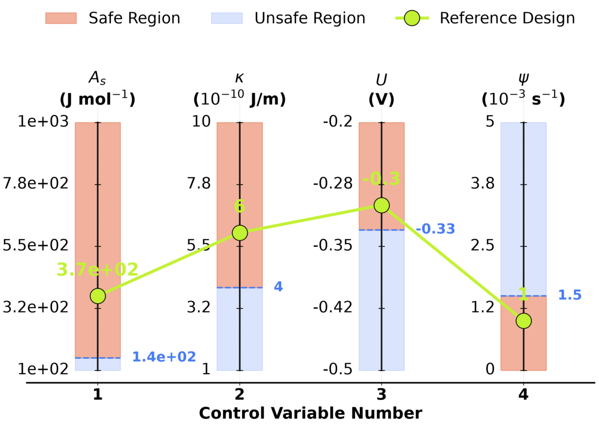

# Understanding the battery dendrites through phase field simulations-informed generative AI

# Phase Field Method 

A binary two-phase phase-field model including an electrochemical reaction has been implemented. 

- Thermodynamically consistent interpolation function is utilized in the dendrites_evolution.i input file

# Generative Machine Learning (Dual-branch VAE)

 (main app, interfacial microstructure construction app)

  ( development version,interfacial microstructure construction app, t-SNE visualization) 

  ( development version,interfacial microstructure construction app, functional expression for hopping strength, t-SNE visualization) 

  ( development version,interfacial microstructure construction app, functional expression for hopping strength, initial values for control params, t-SNE visualization) 

 (test code from development version )

# Postprocessing the Results 
- Chord Diagrams and Radar Charts
  
 (visualization of 15 features )

 (visualization of 15 features )

 (visualization of 15 features )

 (visualization of 15 features )

 (visualization of 15 features )

 (visualization of 15 features )

- Hierarchical data visualization

# Lithium-ion Battery Stability Map

Curvature of Free Energy presented in Normalized Unit

 (Dendrite prevention stability map)

 (R2, Dendrite prevention stability map)

 (R3, Dendrite prevention stability map)

 (R4, Dendrite prevention stability map)

 (R5, Dendrite prevention stability map)

 (R6, Dendrite prevention stability map)

Curvature of Free Energy presented in Denormalized Unit (Physical Unit)

 (R7, Dendrite prevention stability map)

 (R8, Dendrite prevention stability map)

# Authors of this repository :

1. Anil Kunwar 

2. Hao Tang

3. Nele Moelans

How to cite this work: 

If you use the data and codes of this repository in your work, please cite this work:

# H. Tang et al. (2025), Title of the work, Unpublished work (Work in Progress)
